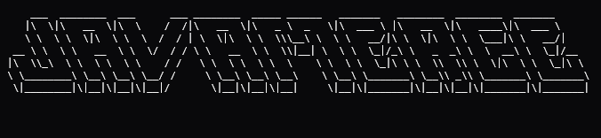

**JavaMerge** é uma ferramenta em Java que lê múltiplos arquivos `.java` de um diretório de entrada e gera um único arquivo consolidado, mantendo apenas a classe principal com `main` como `public` e removendo duplicações de `package` e `import`.  
O objetivo é facilitar atividades acadêmicas e exercícios onde é necessário submeter apenas **um único arquivo Java**, mas o projeto está organizado em vários arquivos.  

---

## 👨‍💻 Funcionalidades
- Lê todos os arquivos `.java` da pasta `entrada/`.  
- Detecta automaticamente qual arquivo contém o método `main`.  
- Remove todas as declarações `package` e centraliza os `import` em um único bloco no início do arquivo final.  
- Garante que apenas a classe que contém o `main` permaneça `public`.  
- Concatena o conteúdo dos demais arquivos, preservando comentários de início/fim para rastreabilidade.  
- Gera um único arquivo na pasta `saida/` com o nome da classe principal (`Main.java`, por exemplo).  

---

## ▶️ Como usar
1. Coloque todos os arquivos `.java` que deseja unificar dentro da pasta `entrada/`.  
2. Compile o programa:  
   ```bash
   javac JavaMerge.java
   ```
3. Execute:  
   ```bash
   java JavaMerge
   ```
4. O arquivo final aparecerá em `saida/<ClassePrincipal>.java`.  

---

## 📌 Exemplo
Suponha que você tenha em `entrada/`:  
- `Main.java` (contendo `public static void main`)  
- `Util.java`  
- `Logavel.java`  

Após rodar o programa, em `saida/` será gerado:  
- `Main.java` → contendo:
  - Cabeçalho de geração  
  - Bloco único de imports  
  - Classe `Main` como `public`  
  - Classes `Util` e `Logavel` como package-private (sem `public`)  

---

## 👤 Autor
Projeto desenvolvido por **Gabriel Evangelista Massara** para auxiliar na submissão de trabalhos e projetos acadêmicos em Java.  
